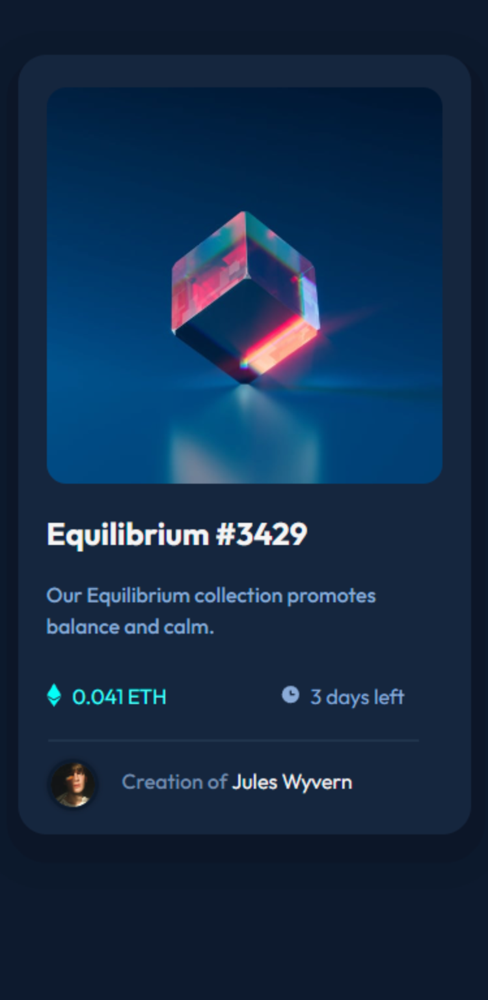

# Frontend Mentor - NFT preview card component solution

This is a solution to the [NFT preview card component challenge on Frontend Mentor](https://www.frontendmentor.io/challenges/nft-preview-card-component-SbdUL_w0U). Frontend Mentor challenges help you improve your coding skills by building realistic projects. 

## Table of contents

- [Overview](#overview)
  - [The challenge](#the-challenge)
  - [Screenshot](#screenshot)
  - [Links](#links)
- [My process](#my-process)
  - [Built with](#built-with)
  - [Other tools used](#other-tools-used)
  - [What I learned](#what-i-learned)
  - [Continued development](#continued-development)
  - [Useful resources](#useful-resources)


## Overview

### The challenge

Users should be able to:

- View the optimal layout depending on their device's screen size
- See hover states for interactive elements

### Screenshot

![]
![]

### Links

- Solution URL: [https://github.com/andr-ch/NFT-preview-card-component.git]
- Live Site URL: [https://andr-ch.github.io/NFT-preview-card-component/]

## My process

### Built with

- Semantic HTML5 markup
- CSS custom properties
- Flexbox
- CSS Grid
- Mobile-first workflow


### Other tools used:
- Pesticide extension -> this is perfect to outline eacth element to better see the placement on the page  
- Developer tools -> available on any browser and is ideal for experimenting with changes to your page without affecting your code
- Imagecolorpicker -> used to choose a color and obtain the corresponding HTML Color Code for the selected pixel of an uploaded picture
- Convertingcolors -> perfect for converting colors and getting all the details about the converted color


### What I learned

1. learned to create a unique visual effect by adding two layers of shadows to an element:
```css
.content {
box-shadow: 1px 12px 0px 10px #0c1628, -1px 12px 0px 30px #0c192c;  
}
```

2. discovered how to make paragraphs and images appear on the same line:
```html
<section class="profile-details">
  <p><span class="made-by">Creation of</span> <span class="creator-name">Jules Wyvern</span> </p>
</section> 
```

3. learned to create an overlay effect on top of an image:
```html
<section class="content-pic">
   
   <div class="image-overlay"></div>
</section>
```

4. how to manage content visibility within .content-pic while containing overflow:
```css
.content-pic {
 overflow: hidden;
}
```

5. ensured the image fills the entire container (.content-pic) while preserving aspect ratio:
```css
.content-pic img {
object-fit: cover; 
}
```

6. applied styles to .image-overlay to cover the entire .content-pic container and initialized it as transparent:
css
```css
.image-overlay {
    position: absolute;
    top: 0;
    left: 0;
    width: 100%;
    height: 100%;
    background-color: rgba(87, 255, 249, 0); 
    opacity: 0;
    transition: opacity 0.3s ease, background-color 0.3s ease; 
    display: flex;
    justify-content: center;
    align-items: center;
}
```

7. using pseudo element to display icon content for the hover effect:
```css
.image-overlay::before {
    content: url('images/icon-view.svg'); 
    display: none; 
}
```

8. adjusted the overlay to become more opaque and transparent on hover:
```css
.content-pic:hover .image-overlay {
    opacity: 1; 
    background-color: rgba(87, 255, 249, 0.3);
}
```

9. displayed the icon content for the hover effect using display: block:
```css
.content-pic:hover .image-overlay::before {
    display: block; 
}
```

10. made the image partially transparent 
```css
.content-pic:hover img {
    opacity: 0.3;
}
```


### Useful resources

- [Example resource 1](https://imagecolorpicker.com/) - This is perfect if you want to extract colors from images.

- [Example resource 2](https://convertingcolors.com/) -  Useful for converting between various color formats such as HSL, RGB, and more. Additionally, it offers a range of other color-related tools and apps to assist in various tasks.

- [Example resource 3](https://stackoverflow.com/) - A good platform where developers can ask questions, provide answers, and engage in discussions related to programming and software development.

- [Example resource 4](https://www.w3schools.com/) - This is additionally valuable for refining coding skills, and the "try me" section is beneficial if you wish to observe the code in action.

- [Example resource 5](https://www.color-hex.com) - Good resource for exploring and discovering color codes, such as hexadecimal color codes commonly used in web design and digital graphics.


